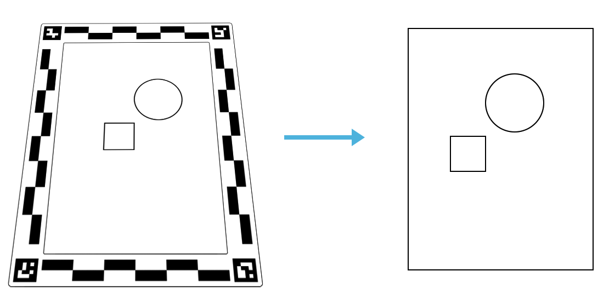

# Urumi Vision

Scan a drawing or image using an ArUco marker frame and convert it to SVG.



## How it works

1. **Extract** (`extract.py`) - Detects the ArUco frame in a photo, corrects perspective and lens distortion, and outputs a rectified PNG with real-world DPI embedded.
2. **Vectorize** (`vectorize.py`) - Converts the extracted PNG to SVG using contour tracing (filled shapes).
3. **Skeletonify** (`skeletonify.py`) - Converts the extracted PNG to SVG using skeletonization (stroke polylines).

All three steps can be run together using `pipeline.py`.

## Installation

```
pip install -r requirements.txt
```

## Quick start

Run the full pipeline on an image:

```
python pipeline.py -i input/keys.jpg
```

This will:
- Detect the ArUco frame and extract the content
- Save an intermediate PNG with DPI metadata
- Convert to SVG and save in `output/`

## Usage

### Full pipeline

```
python pipeline.py -i <INPUT_IMAGE> [-o <OUTPUT_SVG>] [-m contour|skeleton] [-d DPI]
```

Options:
- `-i` Input image (JPG or PNG photo containing an ArUco frame)
- `-o` Output SVG path (default: `output/<name>.svg`)
- `-m` Vectorization mode: `contour` (filled shapes, default) or `skeleton` (polylines)
- `-d` Manual DPI override (default: auto-detect from frame)
- `-c` Frame config file (default: `./config/config.json`)

### Individual steps

**Step 1: Extract from frame**
```
python extract.py -i photo.jpg -o extracted.png -v
```

**Step 2a: Vectorize (contour mode)**
```
python vectorize.py -i extracted.png -o output.svg
```

**Step 2b: Vectorize (skeleton mode)**
```
python skeletonify.py -i extracted.png -o output.svg
```

## ArUco frames

The frame designs are in the `design/` folder. Three sizes are available:
- **Small** (150 x 230 mm)
- **Medium** (210 x 290 mm)
- **Large** (270 x 350 mm)

Print or laser-cut the SVG file for your desired frame size, then photograph your drawing inside the frame.

## Credits

- ArUco frame extraction: Quentin Bolsee 2024
- Skeleton tracing: Lingdong Huang 2020

## License

MIT License
